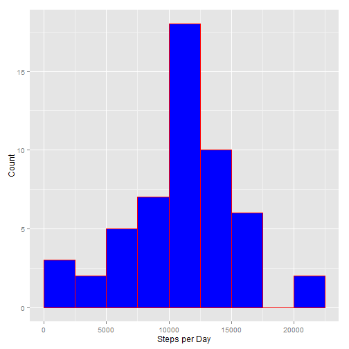
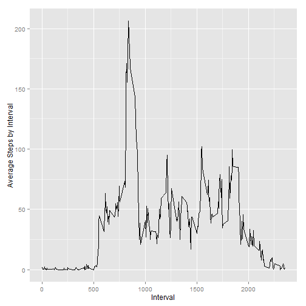
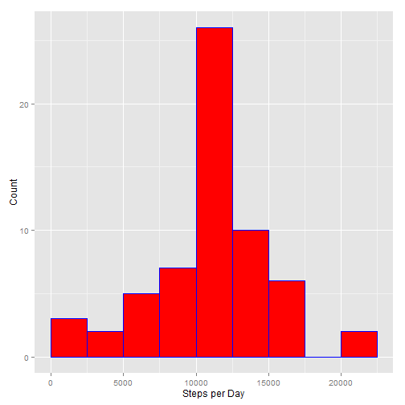
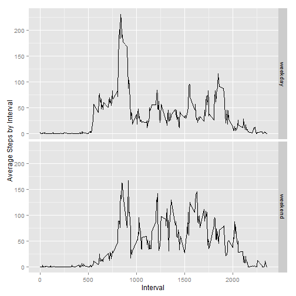

###INTRODUCTION

It is now possible to collect a large amount of data about personal movement using activity monitoring devices such as a Fitbit, Nike Fuelband, or Jawbone Up. These type of devices are part of the "quantified self" movement - a group of enthusiasts who take measurements about themselves regularly to improve their health, to find patterns in their behavior, or because they are tech geeks. But these data remain under-utilized both because the raw data are hard to obtain and there is a lack of statistical methods and software for processing and interpreting the data.  

This assignment makes use of data from a personal activity monitoring device. This device collects data at 5 minute intervals through out the day. The data consists of two months of data from an anonymous individual collected during the months of October and November, 2012 and include the number of steps taken in 5 minute intervals each day.  

The variables included in this dataset are:  

- steps: Number of steps taking in a 5-minute interval (missing values are coded as NA)
- date: The date on which the measurement was taken in YYYY-MM-DD format
- interval: Identifier for the 5-minute interval in which measurement was taken  

The dataset is stored in a comma-separated-value (CSV) file and there are a total of 17,568 observations in this dataset.  

###ANALYSIS REQUIREMENTS  

1. Loading and preprocessing the data
2. What is the mean total number of steps taken per day?
3. What is the average daily activity pattern?
4. Imputing missing values
5. Are there differences in activity patterns between weekdays and weekends?  

Before beginning, we want to load any packages that will be required to complete the analysis:

```r
library(dplyr)
library(ggplot2)
```
  
The data that we will be using for this analysis can be found [here]("https://d396qusza40orc.cloudfront.net/repdata%2Fdata%2Factivity.zip"). The compressed file has been downloaded into a directory within the working directory called "data" and the .csv file within has been extracted and named "activity.csv."
  
####1. Loading and preprocessing the data

First, read in the contents of activity.csv and assign it to an object called "activity."

```r
activity <- tbl_df(read.csv(".//data/activity.csv"))
```

####2. What is the mean total number of steps taken per day?  

There are three components to this portion of the assignment:  
1. Calculate the number of steps taken per day  
2. Make a histogram of the total number of steps taken each day  
3. Calculate and report the mean and median of the total number of steps taken each day  

We can use the *dplyr* package and *group_by* function to quickly find the total number of steps by day. A histogram using *ggplot2* will show that the over 20% of the days ended up between 10,000 and 12,500 steps. It is interesting to see that the median value of steps on all days is 0, indicating that more than half of the measured intervals reported zero steps.


```r
sumsteps_byday <-       group_by(activity, date) %>% ##Group the observations by day
                        summarize(sum(steps)) ##Create a sum of steps for each day

colnames(sumsteps_byday) = c("date", "steps") ##Clean the column names

print(sumsteps_byday)
```

```
## Source: local data frame [61 x 2]
## 
##          date steps
## 1  2012-10-01    NA
## 2  2012-10-02   126
## 3  2012-10-03 11352
## 4  2012-10-04 12116
## 5  2012-10-05 13294
## 6  2012-10-06 15420
## 7  2012-10-07 11015
## 8  2012-10-08    NA
## 9  2012-10-09 12811
## 10 2012-10-10  9900
## ..        ...   ...
```


```r
ggplot(data=sumsteps_byday, aes(steps)) +
        geom_histogram(breaks = seq(0, 22500, by=2500),
                       col = "red",
                       fill = "blue") +
        labs(x="Steps per Day", y="Count")
```

 

We can again use *dplyr* and *group_by* to find the mean and median steps per day.


```r
meansteps_byday <-      group_by(activity, date) %>% ##Group the observations by day
                        summarize(mean(steps)) ##Create a mean of steps for each day

colnames(meansteps_byday) = c("date", "mean steps") ##Clean the column names

mediansteps_byday <-    group_by(activity, date) %>% ##Group the observations by day
                        summarize(median(steps)) ##Create a median of steps for each day

colnames(mediansteps_byday) = c("date", "median steps") ##Clean the column names

merge(meansteps_byday, mediansteps_byday, by="date")
```

```
##          date mean steps median steps
## 1  2012-10-01         NA           NA
## 2  2012-10-02  0.4375000            0
## 3  2012-10-03 39.4166667            0
## 4  2012-10-04 42.0694444            0
## 5  2012-10-05 46.1597222            0
## 6  2012-10-06 53.5416667            0
## 7  2012-10-07 38.2465278            0
## 8  2012-10-08         NA           NA
## 9  2012-10-09 44.4826389            0
## 10 2012-10-10 34.3750000            0
## 11 2012-10-11 35.7777778            0
## 12 2012-10-12 60.3541667            0
## 13 2012-10-13 43.1458333            0
## 14 2012-10-14 52.4236111            0
## 15 2012-10-15 35.2048611            0
## 16 2012-10-16 52.3750000            0
## 17 2012-10-17 46.7083333            0
## 18 2012-10-18 34.9166667            0
## 19 2012-10-19 41.0729167            0
## 20 2012-10-20 36.0937500            0
## 21 2012-10-21 30.6284722            0
## 22 2012-10-22 46.7361111            0
## 23 2012-10-23 30.9652778            0
## 24 2012-10-24 29.0104167            0
## 25 2012-10-25  8.6527778            0
## 26 2012-10-26 23.5347222            0
## 27 2012-10-27 35.1354167            0
## 28 2012-10-28 39.7847222            0
## 29 2012-10-29 17.4236111            0
## 30 2012-10-30 34.0937500            0
## 31 2012-10-31 53.5208333            0
## 32 2012-11-01         NA           NA
## 33 2012-11-02 36.8055556            0
## 34 2012-11-03 36.7048611            0
## 35 2012-11-04         NA           NA
## 36 2012-11-05 36.2465278            0
## 37 2012-11-06 28.9375000            0
## 38 2012-11-07 44.7326389            0
## 39 2012-11-08 11.1770833            0
## 40 2012-11-09         NA           NA
## 41 2012-11-10         NA           NA
## 42 2012-11-11 43.7777778            0
## 43 2012-11-12 37.3784722            0
## 44 2012-11-13 25.4722222            0
## 45 2012-11-14         NA           NA
## 46 2012-11-15  0.1423611            0
## 47 2012-11-16 18.8923611            0
## 48 2012-11-17 49.7881944            0
## 49 2012-11-18 52.4652778            0
## 50 2012-11-19 30.6979167            0
## 51 2012-11-20 15.5277778            0
## 52 2012-11-21 44.3993056            0
## 53 2012-11-22 70.9270833            0
## 54 2012-11-23 73.5902778            0
## 55 2012-11-24 50.2708333            0
## 56 2012-11-25 41.0902778            0
## 57 2012-11-26 38.7569444            0
## 58 2012-11-27 47.3819444            0
## 59 2012-11-28 35.3576389            0
## 60 2012-11-29 24.4687500            0
## 61 2012-11-30         NA           NA
```

####3. What is the average daily activity pattern?
For this portion of the assignment, a time-series plot needs to be created showing the average number of steps by 5-minute interval in order to see which interval has the largest number of steps.

We will again use *dplyr* and *group_by* to create the average, but now by interval as opposed to date. Then we will use *ggplot2* to plot the data. The data shows that interval 835 has the highest average number of steps, at 206.17.


```r
meansteps_byinterval <- group_by(activity, interval) %>% ##Group the observations by interval
                        summarize(mean(steps, na.rm=T)) ##Create a mean of steps for each interval

colnames(meansteps_byinterval) = c("interval", "steps") ##Clean the column names

ggplot(data=meansteps_byinterval, aes(x=interval, y=steps)) + 
        geom_line() + 
        labs(x="Interval", y="Average Steps by Interval")
```

 

####4. Imputing missing values
Within the data set, there are 8 dates that have NAs.


```r
unique(activity$date[is.na(activity$steps)])
```

```
## [1] 2012-10-01 2012-10-08 2012-11-01 2012-11-04 2012-11-09 2012-11-10
## [7] 2012-11-14 2012-11-30
## 61 Levels: 2012-10-01 2012-10-02 2012-10-03 2012-10-04 ... 2012-11-30
```

We will impute values for these missing days by assigning the average interval value across the days.


```r
activity2 = activity

activity2$steps[activity2$date=="2012-10-01"] = meansteps_byinterval$steps
activity2$steps[activity2$date=="2012-10-08"] = meansteps_byinterval$steps
activity2$steps[activity2$date=="2012-11-01"] = meansteps_byinterval$steps
activity2$steps[activity2$date=="2012-11-04"] = meansteps_byinterval$steps
activity2$steps[activity2$date=="2012-11-09"] = meansteps_byinterval$steps
activity2$steps[activity2$date=="2012-11-10"] = meansteps_byinterval$steps
activity2$steps[activity2$date=="2012-11-14"] = meansteps_byinterval$steps
activity2$steps[activity2$date=="2012-11-30"] = meansteps_byinterval$steps
```

Re-running the code to initially detect the NAs confirms that there are no longer any NAs in 'activity2.'


```r
unique(activity2$date[is.na(activity2$steps)])
```

```
## factor(0)
## 61 Levels: 2012-10-01 2012-10-02 2012-10-03 2012-10-04 ... 2012-11-30
```
To create a second histogram with the imputed data set, we must recreate the sum by day:


```r
sumsteps_byday2 <-      group_by(activity2, date) %>% ##Group the observations by day
                        summarize(sum(steps)) ##Create a sum of steps for each day

colnames(sumsteps_byday2) = c("date", "steps") ##Clean the column names
```

Next we will recreate the histogram. Not surprisingly, using the mean values from the rest of the data set gave us a higher concentration of days with steps between 10,000 and 12,500 (up to over 25%):


```r
ggplot(data=sumsteps_byday2, aes(steps)) +
        geom_histogram(breaks = seq(0, 22500, by=2500),
                       col = "blue",
                       fill = "red") +
        labs(x="Steps per Day", y="Count")
```

 

Using the imputed data to look at the mean and median by day gives us some instances where the median is no longer zero.


```r
meansteps_byday2 <-     group_by(activity2, date) %>% ##Group the observations by day
                        summarize(mean(steps)) ##Create a mean of steps for each day

colnames(meansteps_byday2) = c("date", "mean steps") ##Clean the column names

mediansteps_byday2 <-   group_by(activity2, date) %>% ##Group the observations by day
                        summarize(median(steps)) ##Create a median of steps for each day

colnames(mediansteps_byday2) = c("date", "median steps") ##Clean the column names

merge(meansteps_byday2, mediansteps_byday2, by="date")
```

```
##          date mean steps median steps
## 1  2012-10-01 37.3825996     34.11321
## 2  2012-10-02  0.4375000      0.00000
## 3  2012-10-03 39.4166667      0.00000
## 4  2012-10-04 42.0694444      0.00000
## 5  2012-10-05 46.1597222      0.00000
## 6  2012-10-06 53.5416667      0.00000
## 7  2012-10-07 38.2465278      0.00000
## 8  2012-10-08 37.3825996     34.11321
## 9  2012-10-09 44.4826389      0.00000
## 10 2012-10-10 34.3750000      0.00000
## 11 2012-10-11 35.7777778      0.00000
## 12 2012-10-12 60.3541667      0.00000
## 13 2012-10-13 43.1458333      0.00000
## 14 2012-10-14 52.4236111      0.00000
## 15 2012-10-15 35.2048611      0.00000
## 16 2012-10-16 52.3750000      0.00000
## 17 2012-10-17 46.7083333      0.00000
## 18 2012-10-18 34.9166667      0.00000
## 19 2012-10-19 41.0729167      0.00000
## 20 2012-10-20 36.0937500      0.00000
## 21 2012-10-21 30.6284722      0.00000
## 22 2012-10-22 46.7361111      0.00000
## 23 2012-10-23 30.9652778      0.00000
## 24 2012-10-24 29.0104167      0.00000
## 25 2012-10-25  8.6527778      0.00000
## 26 2012-10-26 23.5347222      0.00000
## 27 2012-10-27 35.1354167      0.00000
## 28 2012-10-28 39.7847222      0.00000
## 29 2012-10-29 17.4236111      0.00000
## 30 2012-10-30 34.0937500      0.00000
## 31 2012-10-31 53.5208333      0.00000
## 32 2012-11-01 37.3825996     34.11321
## 33 2012-11-02 36.8055556      0.00000
## 34 2012-11-03 36.7048611      0.00000
## 35 2012-11-04 37.3825996     34.11321
## 36 2012-11-05 36.2465278      0.00000
## 37 2012-11-06 28.9375000      0.00000
## 38 2012-11-07 44.7326389      0.00000
## 39 2012-11-08 11.1770833      0.00000
## 40 2012-11-09 37.3825996     34.11321
## 41 2012-11-10 37.3825996     34.11321
## 42 2012-11-11 43.7777778      0.00000
## 43 2012-11-12 37.3784722      0.00000
## 44 2012-11-13 25.4722222      0.00000
## 45 2012-11-14 37.3825996     34.11321
## 46 2012-11-15  0.1423611      0.00000
## 47 2012-11-16 18.8923611      0.00000
## 48 2012-11-17 49.7881944      0.00000
## 49 2012-11-18 52.4652778      0.00000
## 50 2012-11-19 30.6979167      0.00000
## 51 2012-11-20 15.5277778      0.00000
## 52 2012-11-21 44.3993056      0.00000
## 53 2012-11-22 70.9270833      0.00000
## 54 2012-11-23 73.5902778      0.00000
## 55 2012-11-24 50.2708333      0.00000
## 56 2012-11-25 41.0902778      0.00000
## 57 2012-11-26 38.7569444      0.00000
## 58 2012-11-27 47.3819444      0.00000
## 59 2012-11-28 35.3576389      0.00000
## 60 2012-11-29 24.4687500      0.00000
## 61 2012-11-30 37.3825996     34.11321
```

####5. Are there differences in activity patterns between weekdays and weekends?  

In order to analyze any differences in activity between weekdays and weekends, we must first create a variable that indicates as much.


```r
activity2 <- mutate(activity2, dayofweek = weekdays(as.POSIXlt(activity2$date)))
activity2$daytype <- ifelse(activity2$dayofweek=="Saturday" | activity2$dayofweek=="Sunday", 
                            c("weekend"), c("weekday"))
activity2$daytype <- as.factor(activity2$daytype)
```

Once we have created the factor variable to indicate weekend or weekday, we can average the number of steps by day type and plot. We see that earlier in the day, weekdays tend to have higher step counts than weekends; but as the day progresses, the weekend tends to have higher step counts.


```r
meansteps_bydaytype <-  group_by(activity2, 
                                 interval, daytype) %>% ##Group the observations by interval, then daytype
                        summarize(mean(steps)) ##Create a mean of steps for each interval/daytype combination

colnames(meansteps_bydaytype) = c("interval", "daytype", "steps") ##Clean the column names

ggplot(data = meansteps_bydaytype, aes(x=interval, y=steps)) +
        geom_line() +
        facet_grid(daytype ~ .) + 
        labs(x="Interval", y="Average Steps by Interval")
```

 
